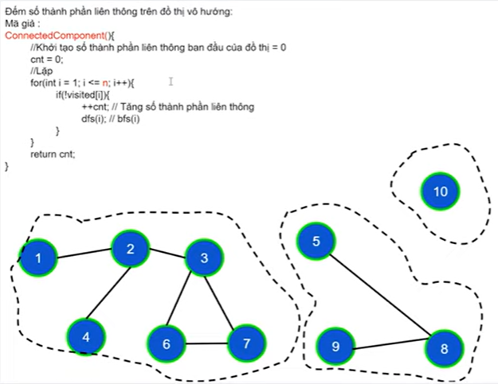
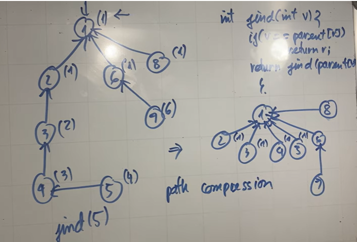
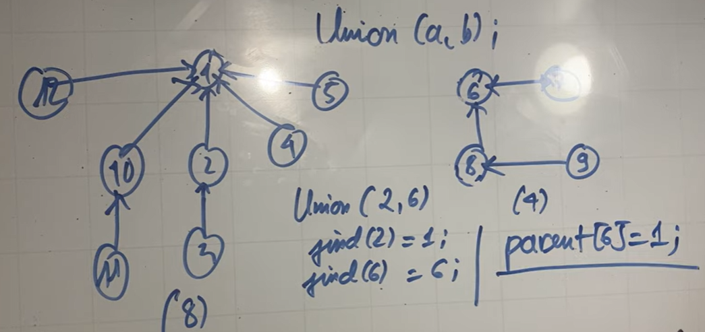
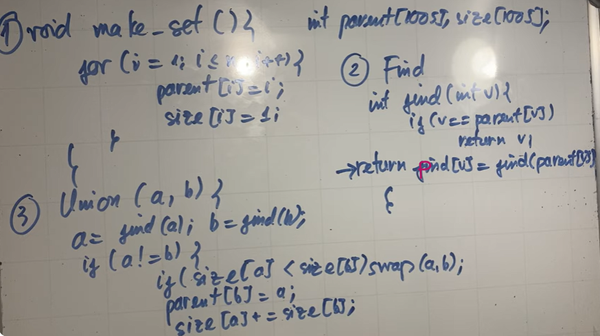

## Các Khái Niệm Cơ Bản Của Đồ Thị
### Đơn đồ thị vô hướng

### Đa đồ thị vô hướng

- Giữa 2 đỉnh có nhiều hơn 1 cạnh
### Giả đồ thị vô hướng

- 2 đỉnh nối 1 cạnh không nhất thiết phải khác nhau 
- Cạnh khuyên: bắt đầu tại 1 đỉnh và kết thúc tai đỉnh đấy 
### Đơn đồ thị có hướng

- Các cạnh có thứ tự (các cung) 
### Đa đồ thị có hướng
- Giữa 2 đỉnh tồn tại nhiều cung khác nhau 
### Đỉnh kề, cạnh liên thuộc 

### Bậc của đỉnh trên đồ thị vô hướng 

- Bậc của đỉnh trên đồ thị là số cạnh liên thuộc với đỉnh đó 
- Đỉnh cô lập là đỉnh có bậc = 0
- Đỉnh treo là đỉnh có bậc = 1
- Tổng bậc = 2 * Số cạnh 
### Bán bậc ra, bán bậc vào 

- Tổng bán bậc ra = Tổng bán bậc vào = Số cạnh 
### Đường đi 

- Đường đi là 1 dãy các đỉnh + cạnh 
- Đường đi đơn: các đỉnh phân biệt 
- Độ dài đường đi = số cạnh 
### Chu trình 

- Là đường đi gồm các cạnh phân biệt, và đỉnh đầu trùng với đỉnh cuối 
### Liên thông trên đồ thị vô hướng 

- Giữa 2 đỉnh bất kì luôn có đường đi 
### Thành phần liên thông 

### Liên thông mạnh, yếu trên đồ thị có hướng 

- Liên thông mạnh: Giữa 2 đỉnh bất kì luôn có đường đi 
- Liên thông yếu: khi đồ thị vô hướng tương ứng của nó liên thông 
## Biểu diễn đồ thị 
### 1. Ma trận kề 
- **Vô hướng**

  - Là ma trận đối xứng 
  - Có cạnh nối giữa 2 đỉnh i,j thì a[i][j] = 1
  - Tổng các phần tử trên hàng = Tổng các phần tử trên cột = Bậc của đỉnh 
  - Tổng phần tử = 2 * cạnh 
- **Có hướng**  

  - Tổng phần tử = cạnh 
  - Bán bậc ra = Tổng ptu trên hàng 
  - Bán bậc vào = Tổng ptu trên cột 
- **Ma trận trọng số**

### Ưu - Nhược ma trận kề 

- Ma trận n đỉnh cần n^2 ô nhớ 
- Xác định đỉnh kề cần duyệt từ 1 đến n ngay cả khi là đỉnh cô lập 
### 2. Danh sách cạnh  

### 3. Danh sách kề 

### Tool
- csacademy.com

## Thuật toán 

### Thuật Toán Tìm Kiếm Theo Chiều Sâu | Giải Thuật DFS
- Dùng đệ quy (Stack) 

### Thuật Toán Tìm Kiếm Theo Chiều Rộng | Giải Thuật BFS
- Dùng (Queue)  

### Áp dụng DFS, BFS
#### Số Thành Phần Liên Thông
- Là số lần gọi DFS/BFS sao cho tất cả các đỉnh của đồ thị được thăm 
- Gọi DFS/BFS để thăm các đỉnh thuộc cùng thành phần liên thông với đỉnh i đấy 

#### Tìm Đường Đi Trên Đồ Thị Không Có Trọng Số.
- Cần thêm mảng parent để truy vết đường đi, parent khác 0 chứng tỏ có đường đi đến điểm đấy 

- 2 đỉnh thuộc cùng 1 thành phần liên thông sẽ luôn có  đường đi  
- Trên đồ thị không có trọng số (có hướng và vô hướng) thuật toán BFS cho đường đi có số cạnh là ngắn nhất 

#### Áp Dụng Thuật Toán DFS, BFS Trên Lưới Ô Vuông (Ma Trận)
#### 1. Đếm số thành phần liên thông trên lưới 

- Tư tưởng 
  - DFS,BFS không còn là 1 đỉnh như trên đồ thị thông thường nữa mà tham số của DFS,BFS là cặp i,j (chỉ số hàng/cột của ô đang xét)
  - check ô kề vẫn phải nằm trên lưới và có đường đi (chưa được thăm)
- Di chuyển từ ô i,j sang 4 ô xung quanh chung đỉnh 

- Di chuyển từ ô i,j sang 8 ô xung quanh

#### 2. Kiểm tra đường đi giữa 2 điểm trên lưới 
- Gọi dfs,bfs A nếu loang tới đỉnh B thì có đường đi 

#### 3. Tìm đường đi ngắn nhất giữa 2 điểm trên lưới 

### Thuật Toán Sắp Xếp Topo
- Đưa ra thứ tự duyệt đỉnh sao cho nếu có đường đi từ u->v thì u sẽ xuất hiện trước trong thứ tự duyệt đấy 

- Không áp dụng khi đồ thị có hướng có chu trình 

#### Topo DFS
- Đỉnh được thăm đầu tiên trong DFS là đỉnh cuối cùng trong thứ tự sắp xếp topo, chính là đỉnh không có đường đi tới các đỉnh khác 

- Giải thuật: dùng dfs, thêm bước đỉnh nào xong đầu thì đưa vào topo 
#### Topo BFS | Thuật Toán Kahn | Thuật toán xóa dần đỉnh 
- Yêu cầu: phải tính được bán bậc vào của các đỉnh trên đồ thị 
- Giải thuật:
  - Chọn ra các đỉnh có bán bậc vào là 0 -> đỉnh đầu tiên trong topo, đưa vào queue
  - Xóa đỉnh khỏi đồ thị (xóa đỉnh ở đầu queue)
  - Duyệt qua các đỉnh kề của đỉnh ở đầu queue đó. Tất cả đỉnh kề với đỉnh đó sẽ có bán bậc vào giảm 1
  - Nếu thấy bậc 0 thì lại đưa đỉnh có bậc 0 đó vào queue
  - Queue rỗng là duyệt xong rồi

### Kiểm Tra Chu Trình Trên Đồ Thị Có Hướng và Vô Hướng.
#### DFS/BFS vô hướng

- Nếu v đã được thăm rồi mà không là cha trực tiếp của u thì cạnh vu là cạnh ngược
- Đỉnh v mở rộng ra đỉnh được thăm rồi nhưng không là cha trực tiếp của nó thì đó là cạnh ngược 

#### DFS/Kahn có hướng
- DFS gồm 3 trạng thái:
  - 0 = White : chưa được thăm
  - 1 = Gray : đã được thăm nhưng chưa thăm xong
  - 2 = Black : thăm xong rồi 
- Chỉ được coi là cạnh ngược khi trạng thái là xám 

- Kahn:
  - Đủ n đỉnh -> K có chu trình 
  - K đủ n đỉnh -> có chu trình 
  - Check được cho cả liên thông và k liên thông (so sánh số đỉnh trong queue và n đỉnh)

### Thuật Toán Kosaraju | Thành Phần Liên Thông Mạnh Của Đồ Thị Có Hướng
- O(2(V+E)) : dùng 2 lần DFS

### Cấu Trúc Dữ Liệu Các Tập Hợp Rời Nhau | Disjoint Set Union DSU | Union Find
- Gồm 3 thao tác
  1. **make_set(a)**: tạo 1 tập hợp chứa phần tử a 
  2. **union(a, b)**: gộp 2 tập hợp lại với nhau 
  3. **find(a)**: tìm ra đại diện tập hợp mà a thuộc
- **Makeset**
  - Duyệt tất cả các phần tử riêng biệt, cho parent của i = chính nó 
- **Find**
  - Đỉnh nào đó có cha là chính nó thì nó là leader
  - Thao tác này tìm đại diện cho 1 đỉnh nào đó  
- **Union**
  - TH1: a, b đã thuộc cùng 1 tập hợp rồi <=> cùng parent
  - TH2: a, b đã thuộc 2 tập hợp khác nhau: cho cha của b thành a 
 
 
 
- Nhược điểm 
  1. Find: O(n) trong hợp tệ nhất 
 
  - Những đỉnh nào trên đường đi đấy gán luôn các đỉnh đấy có chung cha là đại diện của tập hợp đấy luôn => Làm chiều cao của cây ngắn đi 
 
 

  2. Union
 
  - Cho đại diện của cây có kích thước nhỏ hơn gọi đại diện của cây có kích thước lớn hơn là cha 
  - Thao tác gán lại sẽ ít hơn => Tìm cha nhanh hơn vì ít phần tử bị thay đổi cha hơn 
  
- **Tối ưu** 
  