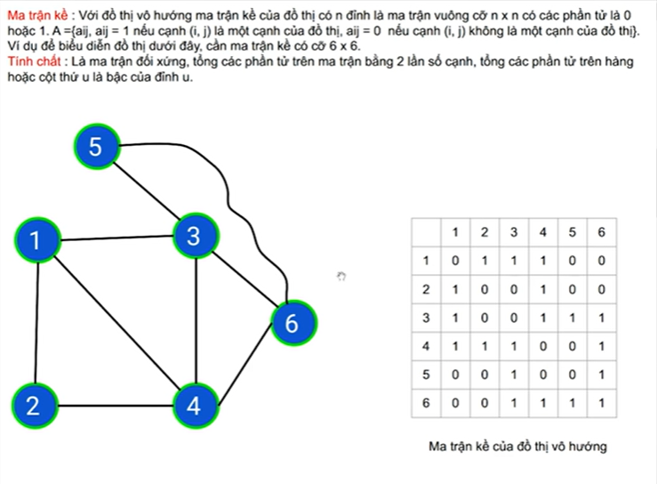
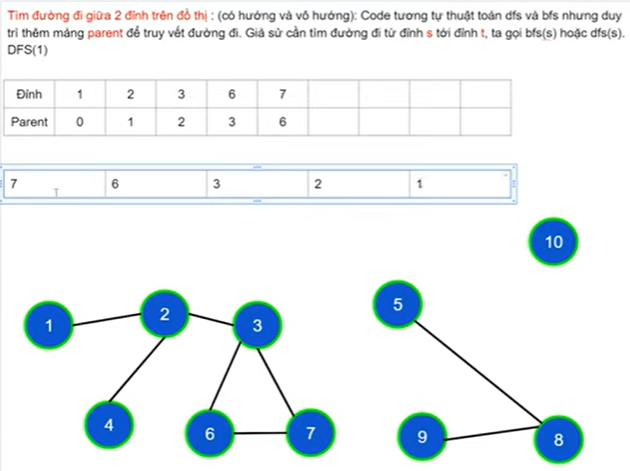

## Các Khái Niệm Cơ Bản Của Đồ Thị
### Đơn đồ thị vô hướng

### Đa đồ thị vô hướng

- Giữa 2 đỉnh có nhiều hơn 1 cạnh
### Giả đồ thị vô hướng

- 2 đỉnh nối 1 cạnh không nhất thiết phải khác nhau 
- Cạnh khuyên: bắt đầu tại 1 đỉnh và kết thúc tai đỉnh đấy 
### Đơn đồ thị có hướng

- Các cạnh có thứ tự (các cung) 
### Đa đồ thị có hướng
- Giữa 2 đỉnh tồn tại nhiều cung khác nhau 
### Đỉnh kề, cạnh liên thuộc 

### Bậc của đỉnh trên đồ thị vô hướng 

- Bậc của đỉnh trên đồ thị là số cạnh liên thuộc với đỉnh đó 
- Đỉnh cô lập là đỉnh có bậc = 0
- Đỉnh treo là đỉnh có bậc = 1
- Tổng bậc = 2 * Số cạnh 
### Bán bậc ra, bán bậc vào 

- Tổng bán bậc ra = Tổng bán bậc vào = Số cạnh 
### Đường đi 

- Đường đi là 1 dãy các đỉnh + cạnh 
- Đường đi đơn: các đỉnh phân biệt 
- Độ dài đường đi = số cạnh 
### Chu trình 

- Là đường đi gồm các cạnh phân biệt, và đỉnh đầu trùng với đỉnh cuối 
### Liên thông trên đồ thị vô hướng 

- Giữa 2 đỉnh bất kì luôn có đường đi 
### Thành phần liên thông 

### Liên thông mạnh, yếu trên đồ thị có hướng 

- Liên thông mạnh: Giữa 2 đỉnh bất kì luôn có đường đi 
- Liên thông yếu: khi đồ thị vô hướng tương ứng của nó liên thông 
## Biểu diễn đồ thị 
### 1. Ma trận kề 
- **Vô hướng**

  - Là ma trận đối xứng 
  - Có cạnh nối giữa 2 đỉnh i,j thì a[i][j] = 1
  - Tổng các phần tử trên hàng = Tổng các phần tử trên cột = Bậc của đỉnh 
  - Tổng phần tử = 2 * cạnh 
- **Có hướng**  

  - Tổng phần tử = cạnh 
  - Bán bậc ra = Tổng ptu trên hàng 
  - Bán bậc vào = Tổng ptu trên cột 
- **Ma trận trọng số**

### Ưu - Nhược ma trận kề 

- Ma trận n đỉnh cần n^2 ô nhớ 
- Xác định đỉnh kề cần duyệt từ 1 đến n ngay cả khi là đỉnh cô lập 
### 2. Danh sách cạnh  

### 3. Danh sách kề 

### Tool
- csacademy.com

## Thuật toán 

### Thuật Toán Tìm Kiếm Theo Chiều Sâu | Giải Thuật DFS
- Dùng đệ quy (Stack) 

### Thuật Toán Tìm Kiếm Theo Chiều Rộng | Giải Thuật BFS
- Dùng (Queue)  

### Áp dụng DFS, BFS
#### Số Thành Phần Liên Thông
- Là số lần gọi DFS/BFS sao cho tất cả các đỉnh của đồ thị được thăm 
- Gọi DFS/BFS để thăm các đỉnh thuộc cùng thành phần liên thông với đỉnh i đấy 

#### Tìm Đường Đi Trên Đồ Thị Không Có Trọng Số.
- Cần thêm mảng parent để truy vết đường đi, parent khác 0 chứng tỏ có đường đi đến điểm đấy 

- 2 đỉnh thuộc cùng 1 thành phần liên thông sẽ luôn có  đường đi  
- Trên đồ thị không có trọng số (có hướng và vô hướng) thuật toán BFS cho đường đi có số cạnh là ngắn nhất 

#### Áp Dụng Thuật Toán DFS, BFS Trên Lưới Ô Vuông

- Tư tưởng 
  - DFS,BFS không còn là 1 đỉnh như trên đồ thị thông thường nữa mà tham số của DFS,BFS là cặp i,j (chỉ số hàng/cột của ô đang xét)
  - check ô kề vẫn phải nằm trên lưới và có đường đi (chưa được thăm)
- Di chuyển từ ô i,j sang 4 ô xung quanh chung đỉnh 

- Di chuyển từ ô i,j sang 8 ô xung quanh
