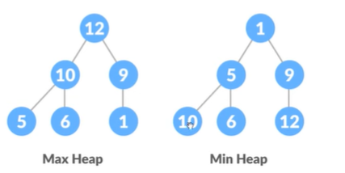
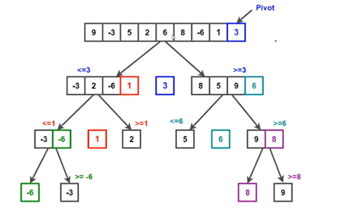
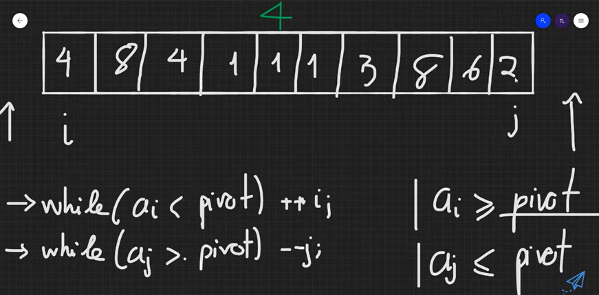

### SELECTION SORT (Sắp xếp chọn)
- Tư tưởng: Ở mỗi bước của thuật toán luôn đưa phần tử nhỏ nhất chưa được sắp xếp về đầu dãy 
- Độ phức tạp: O(n^2)
- Giải thuật: Tìm vị trí ptu nhỏ nhất tính từ i hiện tại cho tới cuối dãy (tìm min trong những phần tử chưa được sắp xếp) rồi hoán vị ptu đó với ptu ở vị trí i => swap (a[i], a[min_pos])
### BUBBLE SORT (Sắp xếp nổi bọt)
- Tư tưởng: So sánh 2 phần tử liền kề và đưa phần tử lớn nhất về cuối dãy 
- Độ phức tạp: O(n^2)
- Giải thuật: Ở mỗi bước của thuật toán sẽ có thêm 1 phần tử được sắp xếp và đưa về cuối dãy - trước < sau => swap
### INSERTION SORT (Sắp xếp chèn)  
- Tư tưởng: Ở mỗi bước của thuật toán sẽ cố gắng đưa phần tử ở vị trí hiện tại về đúng vị trí bằng cách chèn nó vào dãy các phần tử đứng trước nó sao cho đúng thứ tự 
- Độ phức tạp: O(n^2)

### COUTING SORT (Sắp xếp đếm phân phối)
- Tư tưởng: Đếm xem mỗi phần tử trong mảng xuất hiện bn lần, duyệt và in ra từ ptu nhỏ nhất cho tới ptu lớn nhất 
- Độ phức tạp: O(n + max)
- Nhược điểm: k sắp xếp nếu có các phần tử âm hoặc quá lớn (>1e7)

### HEAP SORT
- Heap là 1 cây nhị phân hoàn chỉnh 
- Max-Heap: node cha lớn hơn các node con của nó 
- Min-Heap: node cha nhỏ hơn các node con của nó 

- **Xây Max-Heap**
  - Xét các node k là node lá từ dưới lên 
    - Node đầu tiên k phải node lá là n/2-1 
  - Tiếp tục heapify node bị hoán vị từ trên xuống 
    - Node heapify phải có ít nhất 1 con và node ở cha không là lớn nhất thì gọi đệ quy heapify tới các cây con bên dưới
 - Swap phần tử lớn nhất ptử gốc với phần tử cuối cùng trong cây, cắt node cuối đi
 - Heapify ptu gốc tiếp  
- Độ phức tạp: O(nlogn)
### MERGE SORT
- Thuật toán sắp xếp trộn sử dụng phương pháp chia và trị, chia dãy ban đầu thành dãy con cho tới khi dãy chỉ còn 1 phần tử, sau đó thực hiện trộn 2 dãy con thành 1 dãy tăng dần với độ phức tạp tuyến tính
- Trộn 2 dãy con đã được sắp xếp tạo thành 1 dãy *O(n+m)*
  - Copy dãy bên trái ra 1 mảng, dãy bên phải ra 1 mảng rồi gán lại 
- Độ phức tạp: O(nlogn)
### QUICK SORT
#### Lomuto
- Tư tưởng thuật toán 
  - Chốt là phần tử cuối cùng 
  - i = l-1
  - Duyệt j bắt đầu từ l tới r-1
    - a[j] <= pivot => tăng i lên swap(a[i], a[j])
    - a[j] > pivot => bỏ qua 
  - Sau khi duyệt xong thì tăng i lên trả về vị trí chốt 
 
#### Hoarse 
- Tư tưởng thuật toán 
  - Chốt là phần tử bên trái 
 
  - Duyệt chỉ số i từ bên trái, chỉ số j từ bên phải 
    - Chừng nào a[i] < chốt thì tăng i lên 
    - Chừng nào a[j] > chốt thì giảm i đi  
  - Tìm ra cặp nghịch thế 
    - Khi tìm được phần tử bên trái >= chốt => dừng
    - Khi tìm được phần tử bên phải <= chốt => dừng 
    - => swap(a[i], a[j])
  - Kết thúc khi i > j => trả về vị trí j 