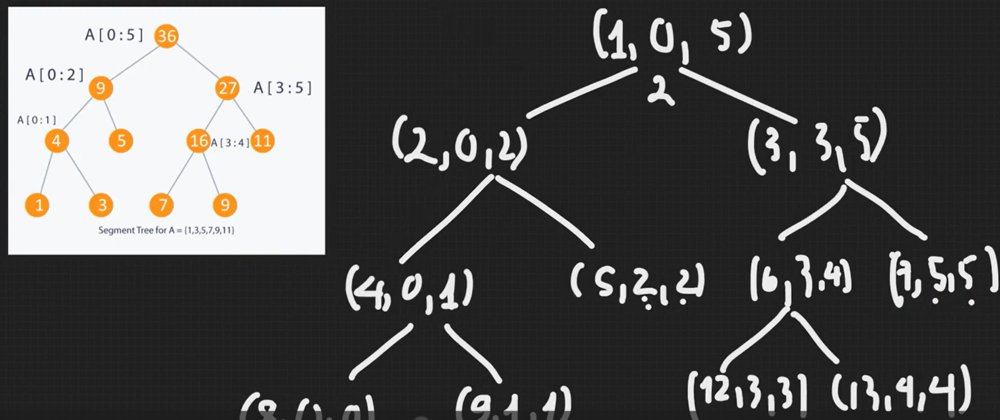
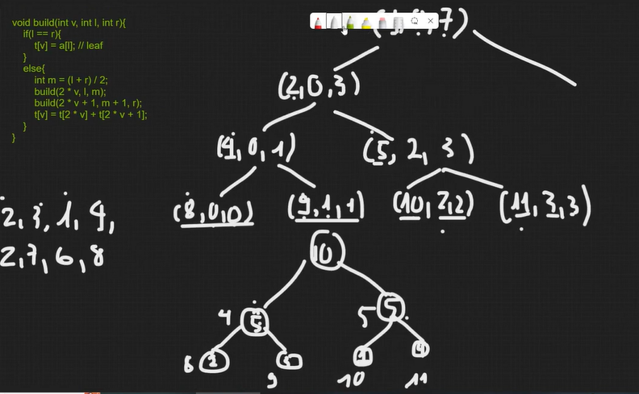
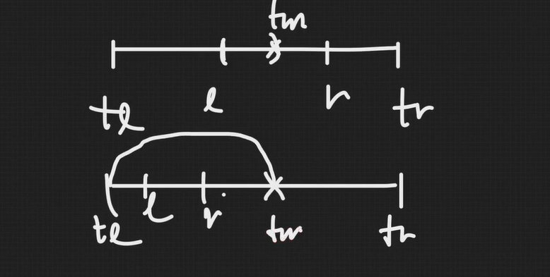
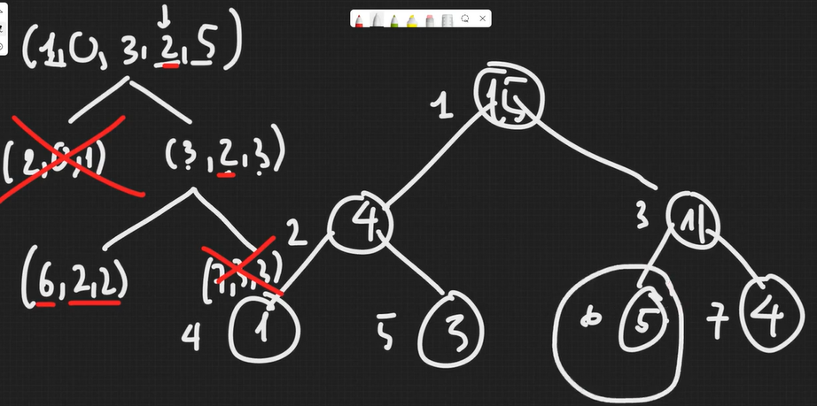

## Segment Tree
- Cây segmente tree là 1 cây nhị phân đầy đủ. Mỗi node có 0 hoặc 2 node con 
- Mảng a có n ptu => Segment tree <= 4*n node 

- Node lá trên cây segment tương ứng với các phần tử trong mảng. Là segment có chỉ số left = right

### Xây dựng cây segment tree | Thao tác build 

- Lời gọi đệ quy bắt đầu từ node gốc STT=1 chạy đến node lá. 
  - ĐK dừng: **l == r** => Node có STT v trên segment tree có giá trị a[left] **t[v] = a[l]**
  - Gọi đệ quy tới cây con trái&phải, đến node lá thì cập nhật t[v] lưu tổng tất cả các ptu từ chỉ số left tới chỉ số right **t[v] = t[2v] + t[2v+1]**

### Truy vấn | Thao tác query 
- O(log n)

### Thao tác update 
- O(log n)
