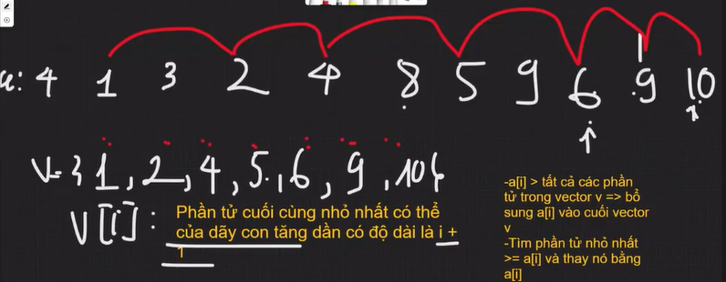
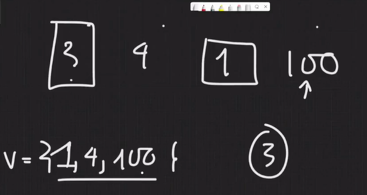

### LIS - Dãy con tăng dài nhất 
- O(n*logn) : Mỗi lần duyệt qua a[i] chỉ cần tìm ra phần tử nhỏ nhất >= a[i] trong vector v (lowerbound hoặc binarysearch)
  - 1. a[i] > tất cả các phần tử trong v -> bổ sung a[i] vào cuối v 
  - 2. Tìm phần tử nhỏ nhất trong v >= a[i] và thay nó = a[i]

- {1, 2, 4} thay 8 thành 5 thì tỉ lệ thêm các ptu vào trong dãy con tăng dần sẽ cao hơn => tối đa khả  năng cho 6 vào 

1. a[i] = 4 > all   
  - v = 4
2. min=4 > a[i] = 1 thay 
  - v = 1
1. 3 > all 
  - v = 1 3
2. min=3 > 2 thay 
  - v = 1 2
1. 4 > all 
  - v = 1 2 4
1. 8 > all 
  - v = 1 2 4 8
2. min=8 >= a[i] 5
  - v = 1 2 4 5
1. 9 > all
  - v = 1 2 4 5 9 
2. min=9 >= 6 thay 
  - v = 1 2 4 5 6
1. 9 > all
  - v = 1 2 4 5 6 9 
1. 10 > all
  - v = 1 2 4 5 6 9 10

 *1 chỉ đại diện cho dãy con tăng dài nhất có độ dài 1*
