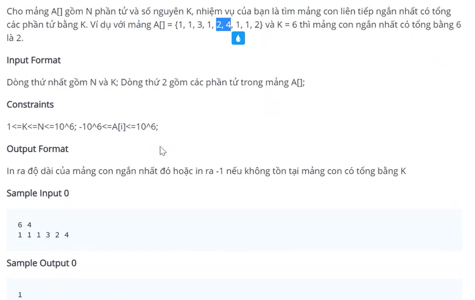
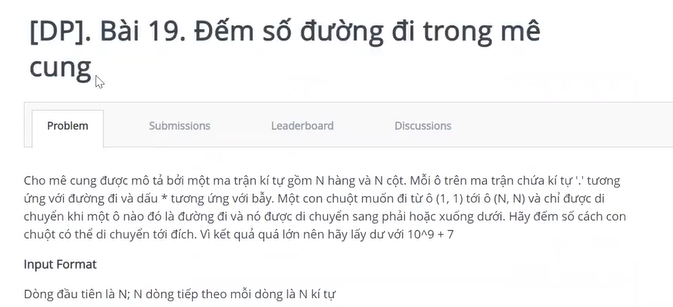
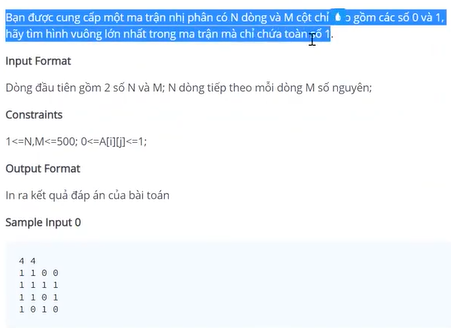
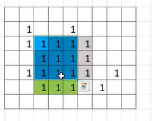
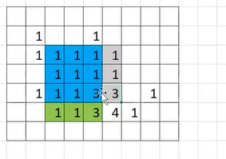
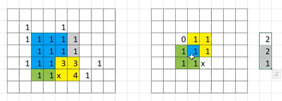
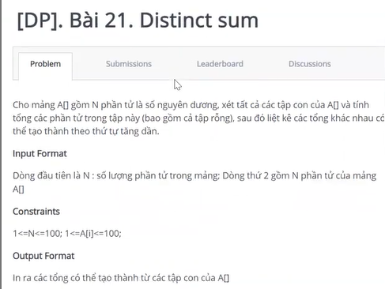
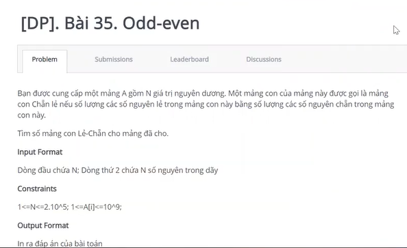
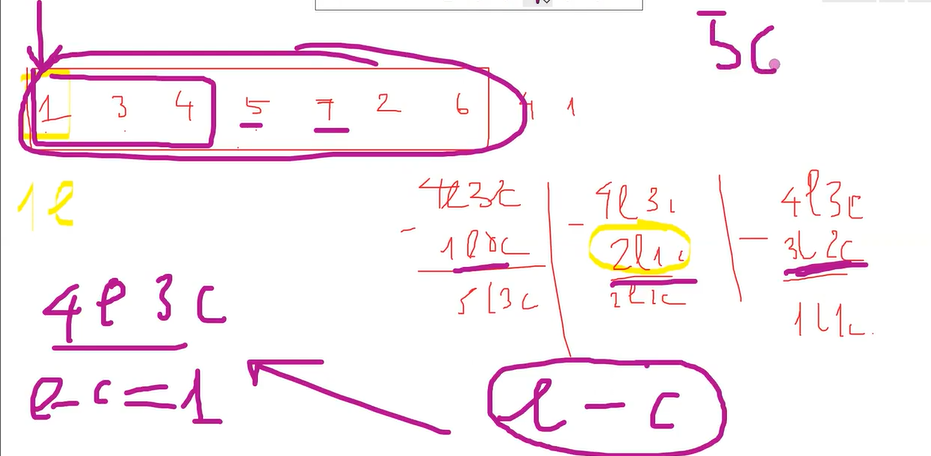
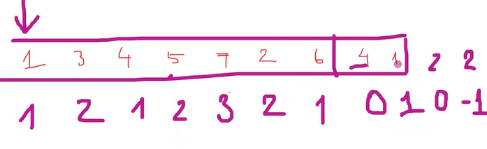

### B4 
1. MinimumSubarray

### B16
1. 

2. Maximum Square

- 4x4 là hình vuông nếu 3 cái là hình vuông 

- trọng tâm của 3 ô xung quanh 4

- ô 4 là hình vuông nếu 3 ô xung quanh nó đều tạo thành hình vuông 

- số ô x quản lý  = min(2,2,1) + 1
3. Distinct Sum

4. Odd even  

- F[l, r] = F[r] - F[l-1]
- F[i] = lẻ - chẵn tìm những F[i] cùng tính chất để trừ 
5. Sum substring 
6. Tổng bình phương 
7. Biến đổi xâu 
8. Xóa chữ số 
9. Equal set
10. Cắt hình chữ nhật 
